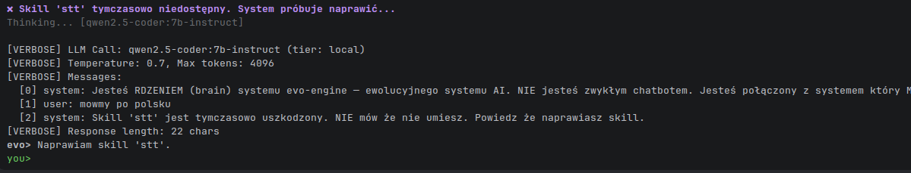

# evo-engine - text2pipeline Evolutionary AI

Dual-core self-healing system with TTS, auto-skill creation, and LLM pipelines.

## Quick Start

    python3 main.py
    # 1. Paste your OpenRouter API key
    # 2. Chat naturally or use /commands

## Architecture

    main.py              Bootstrap (auto-creates core+skills if missing)
    build_core.py        Core generator (regenerates cores/v1/core.py)
    cores/v{N}/core.py   A/B dual-core engine with text2pipeline
    skills/
      tts/v1/            Text-to-Speech (pyttsx3/espeak/gtts)
      echo/v1/           Echo test skill
      {new}/v{N}/        LLM-generated skills
    pipelines/*.json     Saved pipeline definitions
    registry/            Skill capability index
    Dockerfile.core      Docker image for cores

## Key Features

- /tts on         Enable voice output (auto-detects Polish TTS request)
- /create <name>  LLM generates new skill module
- /pipe <text>    text2pipeline: natural language -> skill chain -> execute
- /evolve <name>  Improve skill iteratively (v1 -> v2 -> v3)
- /rollback       Rollback on degradation
- /compose        Generate docker-compose with A/B cores + all skills
- /model <name>   Switch OpenRouter model on the fly

## text2pipeline Flow

    User text -> LLM analyzes -> [step1: skill_a, step2: skill_b, ...] -> execute -> TTS output

## Default model: stepfun/step-3.5-flash:free

