# System Architecture Analysis

## Overview

- **Project**: /home/tom/github/wronai/coreskill/evo-engine
- **Analysis Mode**: static
- **Total Functions**: 397
- **Total Classes**: 61
- **Modules**: 58
- **Entry Points**: 372

## Architecture by Module

### cores.v1.core
- **Functions**: 35
- **File**: `core.py`

### cores.v1.intent_engine
- **Functions**: 23
- **Classes**: 1
- **File**: `intent_engine.py`

### cores.v1.skill_manager
- **Functions**: 20
- **Classes**: 1
- **File**: `skill_manager.py`

### TODO1.preflight
- **Functions**: 17
- **Classes**: 3
- **File**: `preflight.py`

### cores.v1.preflight
- **Functions**: 15
- **Classes**: 3
- **File**: `preflight.py`

### skills.git_ops.v1.skill
- **Functions**: 15
- **Classes**: 1
- **File**: `skill.py`

### cores.v1.provider_selector
- **Functions**: 13
- **Classes**: 2
- **File**: `provider_selector.py`

### cores.v1.llm_client
- **Functions**: 13
- **Classes**: 1
- **File**: `llm_client.py`

### cores.v1.resource_monitor
- **Functions**: 12
- **Classes**: 1
- **File**: `resource_monitor.py`

### TODO1.system_identity
- **Functions**: 12
- **Classes**: 2
- **File**: `system_identity.py`

### skills.web_search.providers.duckduckgo.v1.skill
- **Functions**: 12
- **Classes**: 2
- **File**: `skill.py`

### cores.v1.supervisor
- **Functions**: 10
- **Classes**: 1
- **File**: `supervisor.py`

### skills.devops.v1.skill
- **Functions**: 10
- **Classes**: 1
- **File**: `skill.py`

### cores.v1.system_identity
- **Functions**: 9
- **Classes**: 2
- **File**: `system_identity.py`

### skills.deps.v2.skill
- **Functions**: 9
- **Classes**: 1
- **File**: `skill.py`

### cores.v1.logger
- **Functions**: 8
- **Classes**: 1
- **File**: `logger.py`

### skills.deps.v1.skill
- **Functions**: 8
- **Classes**: 1
- **File**: `skill.py`

### skills.stt.providers.vosk.v6.skill
- **Functions**: 8
- **Classes**: 1
- **File**: `skill.py`

### skills.stt.providers.vosk.v1.skill
- **Functions**: 8
- **Classes**: 1
- **File**: `skill.py`

### skills.stt.providers.vosk.v3.skill
- **Functions**: 8
- **Classes**: 1
- **File**: `skill.py`

## Key Entry Points

Main execution flows into the system:

### cores.v1.core.main
- **Calls**: main.load_state, cores.v1.core._check_restart_loop, Logger, Supervisor, cores.v1.config.cpr, cores.v1.config.cpr, cores.v1.config.cpr, cores.v1.config.cpr

### cores.v1.evo_engine.EvoEngine._execute_with_validation
> Pipeline: preflight → execute → validate result → reflect → retry if needed.
- **Calls**: set, self.sm.latest_v, range, self.sm.latest_v, cores.v1.config.cpr, self.log.core, cores.v1.config.cpr, self.sm.exec_skill

### main.bootstrap
- **Calls**: main.log, main.load_state, state.get, state.get, main.log, str, str, d.mkdir

### cores.v1.skill_manager.SkillManager.smart_evolve
> Evolve skill using devops diagnosis + deps alternatives.
- **Calls**: self.latest_v, self.skill_path, p.read_text, self.diagnose_skill, diag.get, self.log.learn_summary, cores.v1.utils.clean_code, self.preflight.auto_fix_imports

### cores.v1.evo_engine.EvoEngine.handle_request
> Full pipeline: analyze → execute/create/evolve → validate. No user prompts.
- **Calls**: analysis.get, analysis.get, analysis.get, analysis.get, cores.v1.config.cpr, self.log.core, self.llm.analyze_need, isinstance

### TODO1.preflight.SkillPreflight.check_imports
> Stage 2: Do all imports resolve?

Uses subprocess to avoid polluting current process.
Catches the exact "name 'X' is not defined" problem.
- **Calls**: set, set, ast.walk, PreflightResult, ast.parse, isinstance, PreflightResult, skill_path.exists

### cores.v1.intent_engine.IntentEngine.analyze
> Multi-stage intent detection with full conversation context.
- **Calls**: self._update_topics, self._recent_topic, self._build_context, user_msg.strip, stripped.split, self._kw_classify, self._llm_classify, self._ctx_infer

### cores.v1.preflight.SkillPreflight.check_imports
> Stage 2: Do all imports resolve? Detect missing stdlib imports.
- **Calls**: set, set, ast.walk, PreflightResult, ast.parse, isinstance, PreflightResult, skill_path.exists

### TODO1.preflight.SkillPreflight.auto_fix_imports
> Attempt to auto-fix missing imports.

If code uses shutil.which() but doesn't import shutil,
add 'import shutil' at the top.
- **Calls**: set, ast.walk, code.split, enumerate, None.join, ast.parse, isinstance, line.strip

### cores.v1.preflight.SkillPreflight.auto_fix_imports
> Auto-fix missing stdlib imports by adding them at the top.
- **Calls**: set, ast.walk, code.split, enumerate, None.join, ast.parse, isinstance, line.strip

### skills.shell.v1.skill.ShellSkill.execute
- **Calls**: None.strip, None.strip, min, input_data.get, print, int, os.path.expanduser, self._is_interactive

### cores.v1.intent_engine.IntentEngine._extract_shell_command
> Try to extract a shell command from user message or recent conversation.
- **Calls**: any, any, ul.split, enumerate, reversed, None.strip, m.get, re.findall

### skills.git_ops.v1.skill.GitOpsSkill.execute
> evo-engine interface.
- **Calls**: input_data.get, input_data.get, dispatch.get, fn, self.init, self.status, self.add, self.commit

### cores.v1.skill_manager.SkillManager.create_skill
- **Calls**: self.latest_v, self._active_provider, sd.mkdir, self.log.learn_summary, cores.v1.utils.clean_code, None.write_text, None.write_text, None.write_text

### cores.v1.core._cmd_models
- **Calls**: cores.v1.config.cpr, cores.v1.llm_client.discover_models, cores.v1.llm_client._detect_ollama_models, cores.v1.config.cpr, cores.v1.config.cpr, cores.v1.config.cpr, cores.v1.config.cpr, None.join

### skills.stt.providers.vosk.v6.skill.STTSkill.execute
- **Calls**: int, params.get, params.get, int, params.get, params.get, self._transcribe_vosk, isinstance

### skills.stt.providers.vosk.v1.skill.STTSkill.execute
- **Calls**: int, params.get, params.get, int, params.get, params.get, self._transcribe_vosk, isinstance

### skills.stt.providers.vosk.v3.skill.STTSkill.execute
- **Calls**: int, params.get, params.get, int, params.get, params.get, self._transcribe_vosk, isinstance

### cores.v1.evo_engine.EvoEngine.evolve_skill
> Create + evolutionary test loop for new skills.
- **Calls**: cores.v1.config.cpr, self.log.core, cores.v1.config.cpr, self.sm.create_skill, cores.v1.config.cpr, range, self.log.core, self.sm.rollback

### cores.v1.resource_monitor.ResourceMonitor.can_run
> Check if system meets requirements. Returns (bool, reason).
- **Calls**: requirements.get, requirements.get, requirements.get, requirements.get, requirements.get, self._detect_gpu, requirements.get, self._ram_available

### cores.v1.llm_client.LLMClient.analyze_need
> Analyze user request. Keywords FIRST (fast+reliable), LLM only for ambiguous.
- **Calls**: user_msg.lower, any, any, any, any, any, json.dumps, self.chat

### cores.v1.pipeline_manager.PipelineManager.run_p
- **Calls**: json.loads, enumerate, pf.exists, pf.read_text, pipe.get, st.get, si.update, cores.v1.config.cpr

### cores.v1.skill_manager.SkillManager.latest_v
- **Calls**: self._active_provider, d.iterdir, vs.sort, d.exists, prov_dir.is_dir, prov_dir.iterdir, vs.sort, v.is_dir

### cores.v1.skill_manager.SkillManager._load_and_run
> Load skill module and execute. Returns result dict.
- **Calls**: importlib.util.spec_from_file_location, importlib.util.module_from_spec, spec.loader.exec_module, dir, hasattr, str, hasattr, mod.get_info

### cores.v1.core._cmd_profile
- **Calls**: intent._recent_topic, cores.v1.config.cpr, cores.v1.config.cpr, cores.v1.config.cpr, cores.v1.config.cpr, cores.v1.config.cpr, p.get, cores.v1.config.cpr

### skills.llm_router.v1.skill.LLMRouterSkill._discover_remote
> Fetch free models from OpenRouter API.
- **Calls**: urllib.request.Request, data.get, free.sort, urllib.request.urlopen, json.loads, m.get, m.get, float

### TODO1.preflight.SkillPreflight.check_interface
> Stage 3: Does the skill expose required interface?
- get_info() function
- health_check() function
- execute() function OR class with execute() method
- **Calls**: set, ast.iter_child_nodes, PreflightResult, ast.parse, isinstance, PreflightResult, PreflightResult, top_level_funcs.add

### TODO1.preflight.patch_exec_skill
> Wrap SkillManager.exec_skill to add pre-flight checks.

BEFORE: load module → run execute() → crash with 'shutil not defined'
AFTER:  preflight check 
- **Calls**: skill_base.exists, original_exec_skill, sorted, skill_p.exists, preflight.check_all, result.details.get, skill_p.read_text, preflight.auto_fix_imports

### TODO1.preflight.patch_smart_evolve
> Wrap SkillManager.smart_evolve to add evolution guards.

BEFORE: generate code → save → test → fail → repeat same bug
AFTER:  check error history → ad
- **Calls**: str, guard.suggest_strategy, guard.record_error, guard.build_evolution_prompt_context, original_smart_evolve, sorted, skill_p.exists, skill_p.read_text

### cores.v1.logger.Logger.learn_summary
> Build a summary of past errors and successes for learning.
- **Calls**: self.read_skill_log, self.read_core_log, summary.append, summary.append, None.join, l.get, None.join, l.get

## Process Flows

Key execution flows identified:

### Flow 1: main
```
main [cores.v1.core]
  └─> _check_restart_loop
      └─ →> cpr
      └─ →> cpr
  └─ →> load_state
  └─ →> cpr
```

### Flow 2: _execute_with_validation
```
_execute_with_validation [cores.v1.evo_engine.EvoEngine]
  └─ →> cpr
```

### Flow 3: bootstrap
```
bootstrap [main]
  └─> log
  └─> load_state
```

### Flow 4: smart_evolve
```
smart_evolve [cores.v1.skill_manager.SkillManager]
```

### Flow 5: handle_request
```
handle_request [cores.v1.evo_engine.EvoEngine]
  └─ →> cpr
```

### Flow 6: check_imports
```
check_imports [TODO1.preflight.SkillPreflight]
```

### Flow 7: analyze
```
analyze [cores.v1.intent_engine.IntentEngine]
```

### Flow 8: auto_fix_imports
```
auto_fix_imports [TODO1.preflight.SkillPreflight]
```

### Flow 9: execute
```
execute [skills.shell.v1.skill.ShellSkill]
```

### Flow 10: _extract_shell_command
```
_extract_shell_command [cores.v1.intent_engine.IntentEngine]
```

## Key Classes

### cores.v1.intent_engine.IntentEngine
> Multi-stage intent detection with conversation context and learning.
Stages:
  1. Topic tracking (vo
- **Methods**: 23
- **Key Methods**: cores.v1.intent_engine.IntentEngine.__init__, cores.v1.intent_engine.IntentEngine.save, cores.v1.intent_engine.IntentEngine._detect_topics, cores.v1.intent_engine.IntentEngine._update_topics, cores.v1.intent_engine.IntentEngine._recent_topic, cores.v1.intent_engine.IntentEngine._build_context, cores.v1.intent_engine.IntentEngine.record_skill_use, cores.v1.intent_engine.IntentEngine.record_correction, cores.v1.intent_engine.IntentEngine.record_unhandled, cores.v1.intent_engine.IntentEngine.analyze

### cores.v1.skill_manager.SkillManager
- **Methods**: 18
- **Key Methods**: cores.v1.skill_manager.SkillManager.__init__, cores.v1.skill_manager.SkillManager._collect_versions, cores.v1.skill_manager.SkillManager.list_skills, cores.v1.skill_manager.SkillManager.latest_v, cores.v1.skill_manager.SkillManager._active_provider, cores.v1.skill_manager.SkillManager.skill_path, cores.v1.skill_manager.SkillManager.create_skill, cores.v1.skill_manager.SkillManager.diagnose_skill, cores.v1.skill_manager.SkillManager._raw_test, cores.v1.skill_manager.SkillManager.test_skill

### skills.git_ops.v1.skill.GitOpsSkill
> Manage local git repos for skill development and versioning.
- **Methods**: 13
- **Key Methods**: skills.git_ops.v1.skill.GitOpsSkill.__init__, skills.git_ops.v1.skill.GitOpsSkill._run, skills.git_ops.v1.skill.GitOpsSkill.init, skills.git_ops.v1.skill.GitOpsSkill.status, skills.git_ops.v1.skill.GitOpsSkill.add, skills.git_ops.v1.skill.GitOpsSkill.commit, skills.git_ops.v1.skill.GitOpsSkill.log, skills.git_ops.v1.skill.GitOpsSkill.diff, skills.git_ops.v1.skill.GitOpsSkill.tag, skills.git_ops.v1.skill.GitOpsSkill.checkout

### cores.v1.resource_monitor.ResourceMonitor
> Detects CPU, RAM, GPU, disk, installed packages.
- **Methods**: 12
- **Key Methods**: cores.v1.resource_monitor.ResourceMonitor.__init__, cores.v1.resource_monitor.ResourceMonitor.snapshot, cores.v1.resource_monitor.ResourceMonitor._cpu_count, cores.v1.resource_monitor.ResourceMonitor._ram_total, cores.v1.resource_monitor.ResourceMonitor._ram_available, cores.v1.resource_monitor.ResourceMonitor._ram_from_proc, cores.v1.resource_monitor.ResourceMonitor._disk_free, cores.v1.resource_monitor.ResourceMonitor._detect_gpu, cores.v1.resource_monitor.ResourceMonitor._installed_packages, cores.v1.resource_monitor.ResourceMonitor.has_command

### cores.v1.provider_selector.ProviderSelector
> Selects the best available provider for a capability.
- **Methods**: 12
- **Key Methods**: cores.v1.provider_selector.ProviderSelector.__init__, cores.v1.provider_selector.ProviderSelector.list_capabilities, cores.v1.provider_selector.ProviderSelector.list_providers, cores.v1.provider_selector.ProviderSelector.load_manifest, cores.v1.provider_selector.ProviderSelector.load_meta, cores.v1.provider_selector.ProviderSelector.get_provider_info, cores.v1.provider_selector.ProviderSelector.select, cores.v1.provider_selector.ProviderSelector._check_runnable, cores.v1.provider_selector.ProviderSelector._score, cores.v1.provider_selector.ProviderSelector._fallback

### cores.v1.llm_client.LLMClient
> Tiered LLM routing: free remote → local (ollama) → paid remote.
- Rate-limited models get cooldown (
- **Methods**: 11
- **Key Methods**: cores.v1.llm_client.LLMClient.__init__, cores.v1.llm_client.LLMClient.tier_info, cores.v1.llm_client.LLMClient._is_available, cores.v1.llm_client.LLMClient._report_ok, cores.v1.llm_client.LLMClient._report_fail, cores.v1.llm_client.LLMClient.chat, cores.v1.llm_client.LLMClient._build_error_msg, cores.v1.llm_client.LLMClient._try_model, cores.v1.llm_client.LLMClient.gen_code, cores.v1.llm_client.LLMClient.gen_pipeline

### cores.v1.supervisor.Supervisor
> Manages core versions: can create coreB/C/D, test, promote, rollback.
- **Methods**: 10
- **Key Methods**: cores.v1.supervisor.Supervisor.__init__, cores.v1.supervisor.Supervisor.active, cores.v1.supervisor.Supervisor.active_version, cores.v1.supervisor.Supervisor.list_cores, cores.v1.supervisor.Supervisor.switch, cores.v1.supervisor.Supervisor.health, cores.v1.supervisor.Supervisor.create_next_core, cores.v1.supervisor.Supervisor.promote_core, cores.v1.supervisor.Supervisor.rollback_core, cores.v1.supervisor.Supervisor.recover

### TODO1.system_identity.SystemIdentity
> Builds dynamic system prompt that separates:
- What the SYSTEM can do (capabilities)
- What the LLM 
- **Methods**: 8
- **Key Methods**: TODO1.system_identity.SystemIdentity.__init__, TODO1.system_identity.SystemIdentity.refresh_statuses, TODO1.system_identity.SystemIdentity.get_status, TODO1.system_identity.SystemIdentity.build_system_prompt, TODO1.system_identity.SystemIdentity.build_fallback_message, TODO1.system_identity.SystemIdentity.build_skill_context_for_llm, TODO1.system_identity.SystemIdentity.detect_needed_capabilities, TODO1.system_identity.SystemIdentity.get_readiness_report

### cores.v1.logger.Logger
> Per-skill, per-core structured logging with learning.
- **Methods**: 8
- **Key Methods**: cores.v1.logger.Logger.__init__, cores.v1.logger.Logger._write, cores.v1.logger.Logger._entry, cores.v1.logger.Logger.core, cores.v1.logger.Logger.skill, cores.v1.logger.Logger.read_skill_log, cores.v1.logger.Logger.read_core_log, cores.v1.logger.Logger.learn_summary

### skills.devops.v1.skill.DevOpsSkill
> Test, validate and deploy skills in isolated subprocess.
- **Methods**: 8
- **Key Methods**: skills.devops.v1.skill.DevOpsSkill.check_syntax, skills.devops.v1.skill.DevOpsSkill.detect_imports, skills.devops.v1.skill.DevOpsSkill.check_deps, skills.devops.v1.skill.DevOpsSkill.find_system_alternatives, skills.devops.v1.skill.DevOpsSkill.test_skill, skills.devops.v1.skill.DevOpsSkill.health_check_skill, skills.devops.v1.skill.DevOpsSkill.generate_fix_prompt, skills.devops.v1.skill.DevOpsSkill.execute

### cores.v1.system_identity.SystemIdentity
> Builds dynamic system prompt that separates:
- What the SYSTEM can do (capabilities)
- What the LLM 
- **Methods**: 7
- **Key Methods**: cores.v1.system_identity.SystemIdentity.__init__, cores.v1.system_identity.SystemIdentity.refresh_statuses, cores.v1.system_identity.SystemIdentity.get_status, cores.v1.system_identity.SystemIdentity.build_system_prompt, cores.v1.system_identity.SystemIdentity.build_fallback_message, cores.v1.system_identity.SystemIdentity.build_skill_context_for_llm, cores.v1.system_identity.SystemIdentity.get_readiness_report

### TODO1.preflight.EvolutionGuard
> Prevents evolution loops where the same error repeats.

PROBLEM: v6→v7→v8→v9 all with "shutil not de
- **Methods**: 7
- **Key Methods**: TODO1.preflight.EvolutionGuard.__init__, TODO1.preflight.EvolutionGuard.fingerprint, TODO1.preflight.EvolutionGuard.record_error, TODO1.preflight.EvolutionGuard.is_repeating, TODO1.preflight.EvolutionGuard.get_error_summary, TODO1.preflight.EvolutionGuard.suggest_strategy, TODO1.preflight.EvolutionGuard.build_evolution_prompt_context

### cores.v1.preflight.EvolutionGuard
> Prevents evolution loops where the same error repeats.
Tracks error fingerprints and suggests strate
- **Methods**: 7
- **Key Methods**: cores.v1.preflight.EvolutionGuard.__init__, cores.v1.preflight.EvolutionGuard.fingerprint, cores.v1.preflight.EvolutionGuard.record_error, cores.v1.preflight.EvolutionGuard.is_repeating, cores.v1.preflight.EvolutionGuard.get_error_summary, cores.v1.preflight.EvolutionGuard.suggest_strategy, cores.v1.preflight.EvolutionGuard.build_evolution_prompt_context

### skills.deps.v2.skill.DepsSkill
- **Methods**: 7
- **Key Methods**: skills.deps.v2.skill.DepsSkill.__init__, skills.deps.v2.skill.DepsSkill.check_system, skills.deps.v2.skill.DepsSkill.check_python_module, skills.deps.v2.skill.DepsSkill.pip_install, skills.deps.v2.skill.DepsSkill.execute, skills.deps.v2.skill.DepsSkill.get_info, skills.deps.v2.skill.DepsSkill.health_check

### skills.deps.v1.skill.DepsSkill
> Detect, install and manage Python and system dependencies.
- **Methods**: 6
- **Key Methods**: skills.deps.v1.skill.DepsSkill.check_python_module, skills.deps.v1.skill.DepsSkill.check_system_command, skills.deps.v1.skill.DepsSkill.pip_install, skills.deps.v1.skill.DepsSkill.scan_system, skills.deps.v1.skill.DepsSkill.suggest_alternatives, skills.deps.v1.skill.DepsSkill.execute

### TODO1.preflight.SkillPreflight
> Pre-flight validation for skill files.

Run BEFORE exec_skill() and BEFORE accepting evolved code.
- **Methods**: 5
- **Key Methods**: TODO1.preflight.SkillPreflight.check_all, TODO1.preflight.SkillPreflight.check_syntax, TODO1.preflight.SkillPreflight.check_imports, TODO1.preflight.SkillPreflight.check_interface, TODO1.preflight.SkillPreflight.auto_fix_imports

### cores.v1.evo_engine.EvoEngine
> Generic evolutionary algorithm:
1. Detect need → 2. Execute skill → 3. Validate goal → 4. If fail:
 
- **Methods**: 5
- **Key Methods**: cores.v1.evo_engine.EvoEngine.__init__, cores.v1.evo_engine.EvoEngine.handle_request, cores.v1.evo_engine.EvoEngine._execute_with_validation, cores.v1.evo_engine.EvoEngine._validate_result, cores.v1.evo_engine.EvoEngine.evolve_skill

### cores.v1.preflight.SkillPreflight
> Pre-flight validation for skill files.
- **Methods**: 5
- **Key Methods**: cores.v1.preflight.SkillPreflight.check_all, cores.v1.preflight.SkillPreflight.check_syntax, cores.v1.preflight.SkillPreflight.check_imports, cores.v1.preflight.SkillPreflight.check_interface, cores.v1.preflight.SkillPreflight.auto_fix_imports

### skills.web_search.providers.duckduckgo.v1.skill.SimpleHTMLTextExtractor
> Extract visible text from HTML.
- **Methods**: 5
- **Key Methods**: skills.web_search.providers.duckduckgo.v1.skill.SimpleHTMLTextExtractor.__init__, skills.web_search.providers.duckduckgo.v1.skill.SimpleHTMLTextExtractor.handle_starttag, skills.web_search.providers.duckduckgo.v1.skill.SimpleHTMLTextExtractor.handle_endtag, skills.web_search.providers.duckduckgo.v1.skill.SimpleHTMLTextExtractor.handle_data, skills.web_search.providers.duckduckgo.v1.skill.SimpleHTMLTextExtractor.get_text
- **Inherits**: html.parser.HTMLParser

### skills.web_search.providers.duckduckgo.v1.skill.WebSearchSkill
> Search the web and fetch page content using stdlib only.
- **Methods**: 5
- **Key Methods**: skills.web_search.providers.duckduckgo.v1.skill.WebSearchSkill._fetch_url, skills.web_search.providers.duckduckgo.v1.skill.WebSearchSkill.search_duckduckgo, skills.web_search.providers.duckduckgo.v1.skill.WebSearchSkill.fetch_page_text, skills.web_search.providers.duckduckgo.v1.skill.WebSearchSkill.search_and_summarize, skills.web_search.providers.duckduckgo.v1.skill.WebSearchSkill.execute

## Data Transformation Functions

Key functions that process and transform data:

### cores.v1.config._parse_models_override
- **Output to**: isinstance, isinstance, None.strip, x.strip, None.strip

### cores.v1.evo_engine.EvoEngine._validate_result
> Validate whether the skill result actually achieved the goal.
Returns {verdict: success|partial|fail
- **Output to**: result.get, result.get, isinstance, inner.get, inner.get

## Public API Surface

Functions exposed as public API (no underscore prefix):

- `cores.v1.core.main` - 80 calls
- `main.bootstrap` - 33 calls
- `TODO.migrate_skills.migrate_skill` - 33 calls
- `cores.v1.skill_manager.SkillManager.smart_evolve` - 31 calls
- `cores.v1.evo_engine.EvoEngine.handle_request` - 28 calls
- `TODO1.preflight.SkillPreflight.check_imports` - 27 calls
- `cores.v1.intent_engine.IntentEngine.analyze` - 27 calls
- `cores.v1.preflight.SkillPreflight.check_imports` - 27 calls
- `TODO1.preflight.SkillPreflight.auto_fix_imports` - 26 calls
- `cores.v1.preflight.SkillPreflight.auto_fix_imports` - 26 calls
- `skills.shell.v1.skill.ShellSkill.execute` - 26 calls
- `skills.git_ops.v1.skill.GitOpsSkill.execute` - 23 calls
- `cores.v1.skill_manager.SkillManager.create_skill` - 23 calls
- `skills.stt.providers.vosk.v6.skill.STTSkill.execute` - 23 calls
- `skills.stt.providers.vosk.v1.skill.STTSkill.execute` - 23 calls
- `skills.stt.providers.vosk.v3.skill.STTSkill.execute` - 23 calls
- `cores.v1.evo_engine.EvoEngine.evolve_skill` - 19 calls
- `cores.v1.resource_monitor.ResourceMonitor.can_run` - 17 calls
- `cores.v1.llm_client.LLMClient.analyze_need` - 17 calls
- `cores.v1.pipeline_manager.PipelineManager.run_p` - 17 calls
- `cores.v1.skill_manager.SkillManager.latest_v` - 17 calls
- `TODO1.preflight.SkillPreflight.check_interface` - 15 calls
- `TODO1.preflight.patch_exec_skill` - 15 calls
- `TODO1.preflight.patch_smart_evolve` - 15 calls
- `cores.v1.logger.Logger.learn_summary` - 15 calls
- `cores.v1.preflight.SkillPreflight.check_interface` - 15 calls
- `cores.v1.skill_manager.SkillManager.list_skills` - 15 calls
- `TODO.migrate_skills.add_manifest_to_simple` - 14 calls
- `cores.v1.skill_manager.SkillManager.rollback` - 13 calls
- `skills.web_search.providers.duckduckgo.v1.skill.WebSearchSkill.search_duckduckgo` - 13 calls
- `skills.devops.v1.skill.DevOpsSkill.detect_imports` - 13 calls
- `cores.v1.provider_selector.ProviderSelector.list_capabilities` - 12 calls
- `cores.v1.llm_client.LLMClient.chat` - 12 calls
- `cores.v1.pipeline_manager.PipelineManager.create_p` - 12 calls
- `cores.v1.skill_manager.SkillManager.exec_skill` - 12 calls
- `TODO.migrate_skills.main` - 11 calls
- `cores.v1.supervisor.Supervisor.create_next_core` - 11 calls
- `cores.v1.provider_selector.ProviderSelector.select` - 11 calls
- `cores.v1.provider_selector.ProviderSelector.get_skill_path` - 11 calls
- `skills.devops.v1.skill.DevOpsSkill.execute` - 11 calls

## System Interactions

How components interact:

```mermaid
graph TD
    main --> load_state
    main --> _check_restart_loop
    main --> Logger
    main --> Supervisor
    main --> cpr
    _execute_with_valida --> set
    _execute_with_valida --> latest_v
    _execute_with_valida --> range
    _execute_with_valida --> cpr
    bootstrap --> log
    bootstrap --> load_state
    bootstrap --> get
    smart_evolve --> latest_v
    smart_evolve --> skill_path
    smart_evolve --> read_text
    smart_evolve --> diagnose_skill
    smart_evolve --> get
    handle_request --> get
    handle_request --> cpr
    check_imports --> set
    check_imports --> walk
    check_imports --> PreflightResult
    check_imports --> parse
    analyze --> _update_topics
    analyze --> _recent_topic
    analyze --> _build_context
    analyze --> strip
    analyze --> split
    auto_fix_imports --> set
    auto_fix_imports --> walk
```



## Reverse Engineering Guidelines

1. **Entry Points**: Start analysis from the entry points listed above
2. **Core Logic**: Focus on classes with many methods
3. **Data Flow**: Follow data transformation functions
4. **Process Flows**: Use the flow diagrams for execution paths
5. **API Surface**: Public API functions reveal the interface

## Context for LLM

Maintain the identified architectural patterns and public API surface when suggesting changes.