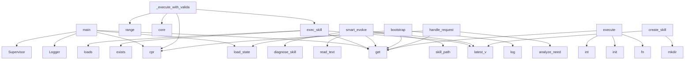

# System Architecture Analysis

## Overview

- **Project**: /home/tom/github/wronai/coreskill/evo-engine
- **Analysis Mode**: static
- **Total Functions**: 145
- **Total Classes**: 16
- **Modules**: 9
- **Entry Points**: 129

## Architecture by Module

### cores.v1.core
- **Functions**: 79
- **Classes**: 8
- **File**: `core.py`

### skills.git_ops.v1.skill
- **Functions**: 15
- **Classes**: 1
- **File**: `skill.py`

### skills.web_search.v1.skill
- **Functions**: 12
- **Classes**: 2
- **File**: `skill.py`

### skills.devops.v1.skill
- **Functions**: 10
- **Classes**: 1
- **File**: `skill.py`

### skills.deps.v1.skill
- **Functions**: 8
- **Classes**: 1
- **File**: `skill.py`

### skills.stt.v1.skill
- **Functions**: 8
- **Classes**: 1
- **File**: `skill.py`

### main
- **Functions**: 5
- **File**: `main.py`

### skills.echo.v1.skill
- **Functions**: 4
- **Classes**: 1
- **File**: `skill.py`

### skills.tts.v1.skill
- **Functions**: 4
- **Classes**: 1
- **File**: `skill.py`

## Key Entry Points

Main execution flows into the system:

### cores.v1.core.main
- **Calls**: cores.v1.core.load_state, state.get, Logger, Supervisor, cores.v1.core.cpr, cores.v1.core.cpr, cores.v1.core.cpr, cores.v1.core.cpr

### cores.v1.core.EvoEngine._execute_with_validation
> Execute skill → validate → diagnose → evolve → retry loop.
- **Calls**: range, cores.v1.core.cpr, self.log.core, cores.v1.core.cpr, self.sm.exec_skill, self.log.core, result.get, cores.v1.core.cpr

### cores.v1.core.SkillManager.exec_skill
> Execute skill, always using latest version.
- **Calls**: mp.exists, self.latest_v, json.loads, m.get, p.exists, importlib.util.spec_from_file_location, importlib.util.module_from_spec, spec.loader.exec_module

### cores.v1.core.SkillManager.smart_evolve
> Evolve skill using devops diagnosis + deps alternatives.
- **Calls**: self.latest_v, self.skill_path, p.read_text, self.diagnose_skill, diag.get, self.log.learn_summary, cores.v1.core._clean, nd.mkdir

### main.bootstrap
- **Calls**: main.log, main.load_state, state.get, state.get, main.log, importlib.util.spec_from_file_location, importlib.util.module_from_spec, spec.loader.exec_module

### cores.v1.core.EvoEngine.handle_request
> Full pipeline: analyze → execute/create/evolve → validate. No user prompts.
- **Calls**: cores.v1.core.cpr, analysis.get, analysis.get, analysis.get, self.llm.analyze_need, isinstance, analysis.get, analysis.get

### skills.git_ops.v1.skill.GitOpsSkill.execute
> evo-engine interface.
- **Calls**: input_data.get, input_data.get, dispatch.get, fn, self.init, self.status, self.add, self.commit

### skills.stt.v1.skill.STTSkill.execute
- **Calls**: int, params.get, params.get, int, params.get, params.get, self._transcribe_vosk, isinstance

### cores.v1.core.SkillManager.create_skill
- **Calls**: self.latest_v, sd.mkdir, self.log.learn_summary, cores.v1.core._clean, None.write_text, None.write_text, None.write_text, self.log.skill

### cores.v1.core.IntentEngine.analyze
> Multi-stage intent detection with full conversation context.
- **Calls**: self._update_topics, self._recent_topic, self._build_context, self._kw_classify, self._llm_classify, self._ctx_infer, self.record_unhandled, self.log.core

### cores.v1.core.EvoEngine.evolve_skill
> Create + evolutionary test loop for new skills.
- **Calls**: cores.v1.core.cpr, self.log.core, cores.v1.core.cpr, self.sm.create_skill, cores.v1.core.cpr, range, self.log.core, self.sm.rollback

### cores.v1.core.LLMClient.analyze_need
> Analyze user request. Keywords FIRST (fast+reliable), LLM only for ambiguous.
- **Calls**: user_msg.lower, any, any, any, any, any, json.dumps, self.chat

### cores.v1.core.PipelineManager.run_p
- **Calls**: json.loads, enumerate, pf.exists, pf.read_text, pipe.get, st.get, si.update, cores.v1.core.cpr

### cores.v1.core.Logger.learn_summary
> Build a summary of past errors and successes for learning.
- **Calls**: self.read_skill_log, self.read_core_log, summary.append, summary.append, None.join, l.get, None.join, l.get

### cores.v1.core.IntentEngine._kw_classify
- **Calls**: msg.lower, any, any, any, any, any, any, ul.split

### skills.web_search.v1.skill.WebSearchSkill.search_duckduckgo
> Search DuckDuckGo Lite (no JS needed).
- **Calls**: self._fetch_url, re.compile, re.compile, link_pattern.findall, snippet_pattern.findall, enumerate, urllib.parse.urlencode, None.strip

### skills.stt.v1.skill.STTSkill._ensure_wav
- **Calls**: Path, tempfile.mkstemp, os.close, subprocess.run, p.exists, FileNotFoundError, p.suffix.lower, str

### skills.devops.v1.skill.DevOpsSkill.detect_imports
> Detect all imports in a Python file.
- **Calls**: ast.walk, open, ast.parse, isinstance, sorted, f.read, isinstance, set

### cores.v1.core.LLMClient.chat
- **Calls**: self._is_available, self._build_error_msg, self._try_model, self.logger.core, self._try_model, main.load_state, main.save_state, self.tier_info

### cores.v1.core.SkillManager.rollback
- **Calls**: sorted, mp.exists, self.log.skill, d.exists, len, json.loads, mp.write_text, mp.read_text

### cores.v1.core.PipelineManager.create_p
- **Calls**: cores.v1.core._clean, None.isoformat, None.write_text, self.log.core, self.llm.gen_pipeline, json.loads, json.dumps, list

### skills.stt.v1.skill.STTSkill._transcribe_vosk
- **Calls**: tempfile.mkstemp, os.close, subprocess.run, RuntimeError, None.strip, isinstance, json.loads, None.unlink

### skills.devops.v1.skill.DevOpsSkill.execute
> evo-engine interface.
- **Calls**: input_data.get, input_data.get, self.test_skill, self.check_syntax, self.check_deps, self.detect_imports, self.health_check_skill, self.find_system_alternatives

### cores.v1.core.LLMClient._try_model
- **Calls**: model.startswith, dict, range, self._report_fail, litellm.completion, self._report_ok, str, self._report_fail

### cores.v1.core.IntentEngine._build_context
- **Calls**: self._recent_topic, self._p.get, parts.append, parts.append, self._p.get, parts.append, parts.append, None.join

### cores.v1.core.Supervisor.create_next_core
> Create new core version by copying current.
- **Calls**: self.active_version, dst_dir.mkdir, shutil.copy2, None.write_text, self.log.core, str, str, None.isoformat

### skills.deps.v1.skill.DepsSkill.execute
> evo-engine interface.
- **Calls**: input_data.get, self.scan_system, self.check_python_module, input_data.get, self.check_system_command, input_data.get, self.pip_install, input_data.get

### skills.devops.v1.skill.DevOpsSkill.generate_fix_prompt
> Generate a prompt for LLM to fix a broken skill.
- **Calls**: test_result.get, test_result.get, test_result.get, test_result.get, alternatives.items, open, f.read, alt.get

### cores.v1.core.IntentEngine.suggest_skills
> Analyze unhandled intents → suggest new skills.
- **Calls**: self._p.get, self.llm.chat, len, json.loads, isinstance, None.join, isinstance, cores.v1.core._clean_json

### cores.v1.core.SkillManager.list_skills
- **Calls**: sorted, SKILLS_DIR.exists, SKILLS_DIR.iterdir, d.is_dir, sorted, d.name.startswith, d.iterdir, v.is_dir

## Process Flows

Key execution flows identified:

### Flow 1: main
```
main [cores.v1.core]
  └─> load_state
  └─> cpr
```

### Flow 2: _execute_with_validation
```
_execute_with_validation [cores.v1.core.EvoEngine]
  └─ →> cpr
  └─ →> cpr
```

### Flow 3: exec_skill
```
exec_skill [cores.v1.core.SkillManager]
```

### Flow 4: smart_evolve
```
smart_evolve [cores.v1.core.SkillManager]
```

### Flow 5: bootstrap
```
bootstrap [main]
  └─> log
  └─> load_state
```

### Flow 6: handle_request
```
handle_request [cores.v1.core.EvoEngine]
  └─ →> cpr
```

### Flow 7: execute
```
execute [skills.git_ops.v1.skill.GitOpsSkill]
```

### Flow 8: create_skill
```
create_skill [cores.v1.core.SkillManager]
  └─ →> _clean
```

### Flow 9: analyze
```
analyze [cores.v1.core.IntentEngine]
```

### Flow 10: evolve_skill
```
evolve_skill [cores.v1.core.EvoEngine]
  └─ →> cpr
  └─ →> cpr
```

## Key Classes

### cores.v1.core.IntentEngine
> Multi-stage intent detection with conversation context and learning.
Stages:
  1. Topic tracking (vo
- **Methods**: 14
- **Key Methods**: cores.v1.core.IntentEngine.__init__, cores.v1.core.IntentEngine.save, cores.v1.core.IntentEngine._detect_topics, cores.v1.core.IntentEngine._update_topics, cores.v1.core.IntentEngine._recent_topic, cores.v1.core.IntentEngine._build_context, cores.v1.core.IntentEngine.record_skill_use, cores.v1.core.IntentEngine.record_correction, cores.v1.core.IntentEngine.record_unhandled, cores.v1.core.IntentEngine.analyze

### skills.git_ops.v1.skill.GitOpsSkill
> Manage local git repos for skill development and versioning.
- **Methods**: 13
- **Key Methods**: skills.git_ops.v1.skill.GitOpsSkill.__init__, skills.git_ops.v1.skill.GitOpsSkill._run, skills.git_ops.v1.skill.GitOpsSkill.init, skills.git_ops.v1.skill.GitOpsSkill.status, skills.git_ops.v1.skill.GitOpsSkill.add, skills.git_ops.v1.skill.GitOpsSkill.commit, skills.git_ops.v1.skill.GitOpsSkill.log, skills.git_ops.v1.skill.GitOpsSkill.diff, skills.git_ops.v1.skill.GitOpsSkill.tag, skills.git_ops.v1.skill.GitOpsSkill.checkout

### cores.v1.core.SkillManager
- **Methods**: 12
- **Key Methods**: cores.v1.core.SkillManager.__init__, cores.v1.core.SkillManager.list_skills, cores.v1.core.SkillManager.latest_v, cores.v1.core.SkillManager.skill_path, cores.v1.core.SkillManager.create_skill, cores.v1.core.SkillManager.diagnose_skill, cores.v1.core.SkillManager._raw_test, cores.v1.core.SkillManager.test_skill, cores.v1.core.SkillManager.exec_skill, cores.v1.core.SkillManager.smart_evolve

### cores.v1.core.LLMClient
> Tiered LLM routing: free remote → local (ollama) → paid remote.
- Rate-limited models get cooldown (
- **Methods**: 11
- **Key Methods**: cores.v1.core.LLMClient.__init__, cores.v1.core.LLMClient.tier_info, cores.v1.core.LLMClient._is_available, cores.v1.core.LLMClient._report_ok, cores.v1.core.LLMClient._report_fail, cores.v1.core.LLMClient.chat, cores.v1.core.LLMClient._build_error_msg, cores.v1.core.LLMClient._try_model, cores.v1.core.LLMClient.gen_code, cores.v1.core.LLMClient.gen_pipeline

### cores.v1.core.Supervisor
> Manages core versions: can create coreB/C/D, test, promote, rollback.
- **Methods**: 10
- **Key Methods**: cores.v1.core.Supervisor.__init__, cores.v1.core.Supervisor.active, cores.v1.core.Supervisor.active_version, cores.v1.core.Supervisor.list_cores, cores.v1.core.Supervisor.switch, cores.v1.core.Supervisor.health, cores.v1.core.Supervisor.create_next_core, cores.v1.core.Supervisor.promote_core, cores.v1.core.Supervisor.rollback_core, cores.v1.core.Supervisor.recover

### skills.devops.v1.skill.DevOpsSkill
> Test, validate and deploy skills in isolated subprocess.
- **Methods**: 8
- **Key Methods**: skills.devops.v1.skill.DevOpsSkill.check_syntax, skills.devops.v1.skill.DevOpsSkill.detect_imports, skills.devops.v1.skill.DevOpsSkill.check_deps, skills.devops.v1.skill.DevOpsSkill.find_system_alternatives, skills.devops.v1.skill.DevOpsSkill.test_skill, skills.devops.v1.skill.DevOpsSkill.health_check_skill, skills.devops.v1.skill.DevOpsSkill.generate_fix_prompt, skills.devops.v1.skill.DevOpsSkill.execute

### cores.v1.core.Logger
> Per-skill, per-core structured logging with learning.
- **Methods**: 8
- **Key Methods**: cores.v1.core.Logger.__init__, cores.v1.core.Logger._write, cores.v1.core.Logger._entry, cores.v1.core.Logger.core, cores.v1.core.Logger.skill, cores.v1.core.Logger.read_skill_log, cores.v1.core.Logger.read_core_log, cores.v1.core.Logger.learn_summary

### skills.deps.v1.skill.DepsSkill
> Detect, install and manage Python and system dependencies.
- **Methods**: 6
- **Key Methods**: skills.deps.v1.skill.DepsSkill.check_python_module, skills.deps.v1.skill.DepsSkill.check_system_command, skills.deps.v1.skill.DepsSkill.pip_install, skills.deps.v1.skill.DepsSkill.scan_system, skills.deps.v1.skill.DepsSkill.suggest_alternatives, skills.deps.v1.skill.DepsSkill.execute

### skills.web_search.v1.skill.SimpleHTMLTextExtractor
> Extract visible text from HTML.
- **Methods**: 5
- **Key Methods**: skills.web_search.v1.skill.SimpleHTMLTextExtractor.__init__, skills.web_search.v1.skill.SimpleHTMLTextExtractor.handle_starttag, skills.web_search.v1.skill.SimpleHTMLTextExtractor.handle_endtag, skills.web_search.v1.skill.SimpleHTMLTextExtractor.handle_data, skills.web_search.v1.skill.SimpleHTMLTextExtractor.get_text
- **Inherits**: html.parser.HTMLParser

### skills.web_search.v1.skill.WebSearchSkill
> Search the web and fetch page content using stdlib only.
- **Methods**: 5
- **Key Methods**: skills.web_search.v1.skill.WebSearchSkill._fetch_url, skills.web_search.v1.skill.WebSearchSkill.search_duckduckgo, skills.web_search.v1.skill.WebSearchSkill.fetch_page_text, skills.web_search.v1.skill.WebSearchSkill.search_and_summarize, skills.web_search.v1.skill.WebSearchSkill.execute

### skills.stt.v1.skill.STTSkill
- **Methods**: 5
- **Key Methods**: skills.stt.v1.skill.STTSkill.__init__, skills.stt.v1.skill.STTSkill._record_wav, skills.stt.v1.skill.STTSkill._ensure_wav, skills.stt.v1.skill.STTSkill._transcribe_vosk, skills.stt.v1.skill.STTSkill.execute

### cores.v1.core.EvoEngine
> Generic evolutionary algorithm:
1. Detect need → 2. Execute skill → 3. Validate goal → 4. If fail:
 
- **Methods**: 5
- **Key Methods**: cores.v1.core.EvoEngine.__init__, cores.v1.core.EvoEngine.handle_request, cores.v1.core.EvoEngine._execute_with_validation, cores.v1.core.EvoEngine._validate_goal, cores.v1.core.EvoEngine.evolve_skill

### cores.v1.core.PipelineManager
- **Methods**: 4
- **Key Methods**: cores.v1.core.PipelineManager.__init__, cores.v1.core.PipelineManager.list_p, cores.v1.core.PipelineManager.create_p, cores.v1.core.PipelineManager.run_p

### skills.tts.v1.skill.TTSSkill
> Text-to-Speech using espeak (stdlib + subprocess only, zero pip deps).
- **Methods**: 2
- **Key Methods**: skills.tts.v1.skill.TTSSkill.__init__, skills.tts.v1.skill.TTSSkill.execute

### skills.echo.v1.skill.EchoSkill
- **Methods**: 1
- **Key Methods**: skills.echo.v1.skill.EchoSkill.execute

### cores.v1.core.C
- **Methods**: 0

## Data Transformation Functions

Key functions that process and transform data:

### cores.v1.core._parse_models_override
- **Output to**: isinstance, isinstance, None.strip, x.strip, None.strip

### cores.v1.core.EvoEngine._validate_goal
> Validate goal from result metadata.
- **Output to**: result.get, r.get, isinstance, r.get, r.get

## Public API Surface

Functions exposed as public API (no underscore prefix):

- `cores.v1.core.main` - 251 calls
- `cores.v1.core.SkillManager.exec_skill` - 31 calls
- `cores.v1.core.SkillManager.smart_evolve` - 29 calls
- `main.bootstrap` - 25 calls
- `cores.v1.core.EvoEngine.handle_request` - 25 calls
- `skills.git_ops.v1.skill.GitOpsSkill.execute` - 23 calls
- `skills.stt.v1.skill.STTSkill.execute` - 23 calls
- `cores.v1.core.SkillManager.create_skill` - 22 calls
- `cores.v1.core.IntentEngine.analyze` - 21 calls
- `cores.v1.core.EvoEngine.evolve_skill` - 19 calls
- `cores.v1.core.LLMClient.analyze_need` - 17 calls
- `cores.v1.core.PipelineManager.run_p` - 17 calls
- `cores.v1.core.Logger.learn_summary` - 15 calls
- `skills.web_search.v1.skill.WebSearchSkill.search_duckduckgo` - 13 calls
- `skills.devops.v1.skill.DevOpsSkill.detect_imports` - 13 calls
- `cores.v1.core.LLMClient.chat` - 12 calls
- `cores.v1.core.SkillManager.rollback` - 12 calls
- `cores.v1.core.PipelineManager.create_p` - 12 calls
- `skills.devops.v1.skill.DevOpsSkill.execute` - 11 calls
- `cores.v1.core.Supervisor.create_next_core` - 11 calls
- `skills.deps.v1.skill.DepsSkill.execute` - 10 calls
- `skills.devops.v1.skill.DevOpsSkill.generate_fix_prompt` - 10 calls
- `cores.v1.core.discover_models` - 10 calls
- `cores.v1.core.IntentEngine.suggest_skills` - 10 calls
- `cores.v1.core.SkillManager.list_skills` - 10 calls
- `cores.v1.core.SkillManager.diagnose_skill` - 10 calls
- `skills.devops.v1.skill.DevOpsSkill.test_skill` - 8 calls
- `cores.v1.core.SkillManager.latest_v` - 8 calls
- `cores.v1.core.gen_compose` - 8 calls
- `skills.web_search.v1.skill.WebSearchSkill.fetch_page_text` - 7 calls
- `skills.web_search.v1.skill.WebSearchSkill.execute` - 7 calls
- `skills.devops.v1.skill.DevOpsSkill.check_deps` - 7 calls
- `skills.devops.v1.skill.DevOpsSkill.health_check_skill` - 7 calls
- `main.log` - 6 calls
- `cores.v1.core.Logger.read_skill_log` - 6 calls
- `cores.v1.core.Logger.read_core_log` - 6 calls
- `cores.v1.core.IntentEngine.record_correction` - 6 calls
- `cores.v1.core.Supervisor.list_cores` - 6 calls
- `cores.v1.core.get_models_from_config` - 5 calls
- `cores.v1.core.LLMClient.tier_info` - 5 calls

## System Interactions

How components interact:



## Reverse Engineering Guidelines

1. **Entry Points**: Start analysis from the entry points listed above
2. **Core Logic**: Focus on classes with many methods
3. **Data Flow**: Follow data transformation functions
4. **Process Flows**: Use the flow diagrams for execution paths
5. **API Surface**: Public API functions reveal the interface

## Context for LLM

Maintain the identified architectural patterns and public API surface when suggesting changes.