# System Architecture Analysis

## Overview

- **Project**: /home/tom/github/wronai/coreskill
- **Analysis Mode**: static
- **Total Functions**: 629
- **Total Classes**: 75
- **Modules**: 59
- **Entry Points**: 573

## Architecture by Module

### cores.v1.core
- **Functions**: 50
- **File**: `core.py`

### cores.v1.smart_intent
- **Functions**: 30
- **Classes**: 5
- **File**: `smart_intent.py`

### core
- **Functions**: 29
- **Classes**: 6
- **File**: `core.py`

### seeds.core_v1
- **Functions**: 27
- **Classes**: 5
- **File**: `core_v1.py`

### cores.v1.provider_selector
- **Functions**: 26
- **Classes**: 3
- **File**: `provider_selector.py`

### cores.v1.skill_manager
- **Functions**: 24
- **Classes**: 1
- **File**: `skill_manager.py`

### cores.v1.session_config
- **Functions**: 23
- **Classes**: 2
- **File**: `session_config.py`

### cores.v1.auto_repair
- **Functions**: 22
- **Classes**: 2
- **File**: `auto_repair.py`

### cores.v1.evo_journal
- **Functions**: 20
- **Classes**: 2
- **File**: `evo_journal.py`

### skills.benchmark.v1.skill
- **Functions**: 18
- **Classes**: 3
- **File**: `skill.py`

### cores.v1.preflight
- **Functions**: 17
- **Classes**: 3
- **File**: `preflight.py`

### cores.v1.self_healing
- **Functions**: 17
- **Classes**: 6
- **File**: `__init__.py`

### cores.v1.intent_engine
- **Functions**: 15
- **Classes**: 1
- **File**: `intent_engine.py`

### skills.git_ops.v1.skill
- **Functions**: 15
- **Classes**: 1
- **File**: `skill.py`

### cores.v1.config
- **Functions**: 14
- **Classes**: 1
- **File**: `config.py`

### cores.v1.llm_client
- **Functions**: 14
- **Classes**: 1
- **File**: `llm_client.py`

### cores.v1.resource_monitor
- **Functions**: 12
- **Classes**: 1
- **File**: `resource_monitor.py`

### skills.web_search.providers.duckduckgo.v1.skill
- **Functions**: 12
- **Classes**: 2
- **File**: `skill.py`

### cores.v1.logger
- **Functions**: 11
- **Classes**: 1
- **File**: `logger.py`

### skills.openrouter.v1.skill
- **Functions**: 11
- **Classes**: 1
- **File**: `skill.py`

## Key Entry Points

Main execution flows into the system:

### core.main
- **Calls**: core.load_state, Supervisor, core.cpr, core.cpr, core.cpr, core.cpr, core.save_state, state.get

### cores.v1.core.main
- **Calls**: cores.v1.skill_logger.init_nfo, main.load_state, cores.v1.core._check_restart_loop, Logger, Supervisor, cores.v1.config.cpr, cores.v1.config.cpr, cores.v1.config.cpr

### seeds.core_v1.main
- **Calls**: seeds.core_v1.load_state, Supervisor, seeds.core_v1.cpr, seeds.core_v1.cpr, seeds.core_v1.cpr, seeds.core_v1.cpr, seeds.core_v1.save_state, state.get

### cores.v1.evo_engine.EvoEngine._execute_with_validation
> Pipeline: preflight → execute → validate result → reflect → retry if needed.
Now with journal tracking and quality reflection.
- **Calls**: cores.v1.session_config.SessionConfig.set, self.sm.latest_v, self.journal.get_skill_history, self.journal.start_evolution, range, self.journal.finish_evolution, self.sm.latest_v, cores.v1.config.cpr

### scripts.simulate.Simulator._final_report
- **Calls**: print, print, print, len, sum, list, print, print

### scripts.simulate.Simulator.run_scenario
> Run a single scenario.
- **Calls**: scenario.get, scenario.get, print, print, print, SimulationResult, enumerate, result.finish

### cores.v1.skill_logger.get_markdown_logs
> Get logs formatted as markdown ready for LLM with code blocks.
- **Calls**: _SQLITE_PATH.exists, sqlite3.connect, conn.close, None.join, str, None.fetchall, None.fetchall, dict

### cores.v1.evo_engine.EvoEngine._autonomous_stt_repair
> Autonomous diagnosis and repair for STT empty transcription.
Returns (fixed, message, new_result).
- **Calls**: cores.v1.config.cpr, any, cores.v1.config.cpr, shutil.which, cores.v1.config.cpr, Path, cores.v1.config.cpr, cores.v1.config.cpr

### cores.v1.llm_client.LLMClient.chat
- **Calls**: self._is_available, bool, self._build_error_msg, os.environ.get, print, print, print, enumerate

### cores.v1.skill_manager.SkillManager.smart_evolve
> Evolve skill using devops diagnosis + deps alternatives.
- **Calls**: self.latest_v, self.skill_path, p.read_text, self.diagnose_skill, diag.get, self.get_health_context, self.log.learn_summary, cores.v1.utils.clean_code

### cores.v1.core._cmd_apikey
> Set or show OpenRouter API key: /apikey [key]
- **Calls**: ctx.get, None.strip, cores.v1.config.cpr, main.save_state, cores.v1.config.cpr, cores.v1.config.cpr, cores.v1.config.cpr, state.get

### main.bootstrap
- **Calls**: main.log, main.load_state, state.get, state.get, main.log, str, str, d.mkdir

### examples.skills.01_create.main
- **Calls**: print, Path, print, print, skill_dir.mkdir, print, skill_file.write_text, print

### cores.v1.evo_engine.EvoEngine.evolve_skill
> Create + evolutionary test loop for new skills.
Enhanced with journal tracking and cross-iteration reflection.
- **Calls**: cores.v1.config.cpr, self.log.core, self.journal.start_evolution, time.time, cores.v1.config.cpr, self.sm.create_skill, cores.v1.config.cpr, range

### examples.advanced.01_pipeline.main
- **Calls**: print, main.load_state, LLMClient, SkillManager, sm.list_skills, IntentEngine, EvoEngine, print

### cores.v1.evo_engine.EvoEngine.handle_request
> Full pipeline: analyze → execute/create/evolve → validate. No user prompts.
- **Calls**: analysis.get, analysis.get, analysis.get, analysis.get, cores.v1.config.cpr, self.log.core, self.llm.analyze_need, isinstance

### cores.v1.evo_engine.EvoEngine._try_fallback_providers
> Try alternative providers from the chain when primary fails.
- **Calls**: self.provider_chain.select_with_fallback, self.sm._active_provider, cores.v1.config.cpr, cores.v1.config.cpr, len, cores.v1.config.cpr, self.sm.provider_selector.get_skill_path, cores.v1.config.cpr

### scripts.simulate.Simulator.run_all
> Run all scenarios for N iterations.
- **Calls**: range, self._final_report, self.evo.journal.get_global_stats, journal_file.write_text, print, print, print, print

### cores.v1.intent_engine.IntentEngine.analyze
> ML-based intent detection.

Flow:
  Stage 0: Trivial filter
  Stage 1: SmartIntentClassifier (embedding → local LLM → remote LLM)
  Stage 2: Context i
- **Calls**: user_msg.strip, stripped.split, self._build_context, self._classifier.classify, self._recent_topic, self.record_unhandled, isinstance, list

### cores.v1.preflight.SkillPreflight.check_imports
> Stage 2: Do all imports resolve? Detect missing stdlib imports.
- **Calls**: cores.v1.session_config.SessionConfig.set, cores.v1.session_config.SessionConfig.set, ast.walk, PreflightResult, ast.parse, isinstance, PreflightResult, skill_path.exists

### cores.v1.preflight.SkillPreflight.auto_fix_imports
> Auto-fix missing stdlib imports by adding them at the top.
- **Calls**: cores.v1.session_config.SessionConfig.set, ast.walk, code.split, enumerate, None.join, ast.parse, isinstance, line.strip

### skills.shell.v1.skill.ShellSkill.execute
- **Calls**: None.strip, None.strip, min, input_data.get, print, int, os.path.expanduser, self._is_interactive

### seeds.core_v1.SkillManager.exec_skill
- **Calls**: mp.exists, self.latest_v, json.loads, m.get, p.exists, importlib.util.spec_from_file_location, importlib.util.module_from_spec, spec.loader.exec_module

### cores.v1.skill_logger.get_health_markdown
> Get health summary for all skills as markdown.
- **Calls**: _SQLITE_PATH.exists, sqlite3.connect, None.fetchall, conn.close, cores.v1.session_config.SessionConfig.set, sorted, None.join, str

### scripts.simulate.Simulator._init_system
> Initialize all evo-engine components.
- **Calls**: cores.v1.skill_logger.init_nfo, main.load_state, Logger, cores.v1.config.get_models_from_config, LLMClient, ResourceMonitor, ProviderSelector, SkillManager

### cli.main_cli
> Main CLI entry point.
- **Calls**: argparse.ArgumentParser, parser.add_subparsers, subparsers.add_parser, logs_parser.add_subparsers, logs_sub.add_parser, subparsers.add_parser, cache_parser.add_subparsers, cache_sub.add_parser

### cores.v1.core._cmd_models
- **Calls**: cores.v1.config.cpr, cores.v1.llm_client.discover_models, cores.v1.llm_client._detect_ollama_models, cores.v1.config.cpr, cores.v1.config.cpr, cores.v1.config.cpr, cores.v1.config.cpr, None.join

### cores.v1.skill_manager.SkillManager.create_skill
- **Calls**: self.latest_v, self._active_provider, sd.mkdir, self.log.learn_summary, cores.v1.utils.clean_code, None.write_text, None.write_text, None.write_text

### skills.git_ops.v1.skill.GitOpsSkill.execute
> evo-engine interface.
- **Calls**: input_data.get, input_data.get, dispatch.get, fn, self.init, self.status, self.add, self.commit

### skills.stt.providers.vosk.archive.v6.skill.STTSkill.execute
- **Calls**: int, params.get, params.get, int, params.get, params.get, self._transcribe_vosk, isinstance

## Process Flows

Key execution flows identified:

### Flow 1: main
```
main [core]
  └─> load_state
  └─> cpr
```

### Flow 2: _execute_with_validation
```
_execute_with_validation [cores.v1.evo_engine.EvoEngine]
  └─ →> set
```

### Flow 3: _final_report
```
_final_report [scripts.simulate.Simulator]
```

### Flow 4: run_scenario
```
run_scenario [scripts.simulate.Simulator]
```

### Flow 5: get_markdown_logs
```
get_markdown_logs [cores.v1.skill_logger]
```

### Flow 6: _autonomous_stt_repair
```
_autonomous_stt_repair [cores.v1.evo_engine.EvoEngine]
  └─ →> cpr
  └─ →> cpr
```

### Flow 7: chat
```
chat [cores.v1.llm_client.LLMClient]
```

### Flow 8: smart_evolve
```
smart_evolve [cores.v1.skill_manager.SkillManager]
```

### Flow 9: _cmd_apikey
```
_cmd_apikey [cores.v1.core]
  └─ →> cpr
  └─ →> cpr
  └─ →> save_state
```

### Flow 10: bootstrap
```
bootstrap [main]
  └─> log
  └─> load_state
```

## Key Classes

### cores.v1.session_config.SessionConfig
> User-facing configuration manager.

This is a SESSION-ONLY layer - changes are NOT persisted to disk
- **Methods**: 25
- **Key Methods**: cores.v1.session_config.SessionConfig.__init__, cores.v1.session_config.SessionConfig.CATEGORIES, cores.v1.session_config.SessionConfig.PROVIDER_TIERS, cores.v1.session_config.SessionConfig.get, cores.v1.session_config.SessionConfig.set, cores.v1.session_config.SessionConfig.reset, cores.v1.session_config.SessionConfig.on_change, cores.v1.session_config.SessionConfig._notify, cores.v1.session_config.SessionConfig.handle_configure_intent, cores.v1.session_config.SessionConfig._configure_llm

### cores.v1.skill_manager.SkillManager
- **Methods**: 22
- **Key Methods**: cores.v1.skill_manager.SkillManager.__init__, cores.v1.skill_manager.SkillManager._collect_versions, cores.v1.skill_manager.SkillManager.list_skills, cores.v1.skill_manager.SkillManager._is_rolled_back, cores.v1.skill_manager.SkillManager.latest_v, cores.v1.skill_manager.SkillManager._active_provider, cores.v1.skill_manager.SkillManager.skill_path, cores.v1.skill_manager.SkillManager.create_skill, cores.v1.skill_manager.SkillManager.diagnose_skill, cores.v1.skill_manager.SkillManager._raw_test

### cores.v1.auto_repair.AutoRepair
> Self-healing engine with task-based repair loop.

Flow per task:
    1. DIAGNOSE — identify exact is
- **Methods**: 20
- **Key Methods**: cores.v1.auto_repair.AutoRepair.__init__, cores.v1.auto_repair.AutoRepair.run_boot_repair, cores.v1.auto_repair.AutoRepair.repair_skill, cores.v1.auto_repair.AutoRepair._scan_all_skills, cores.v1.auto_repair.AutoRepair._list_all_skills, cores.v1.auto_repair.AutoRepair._diagnose_skill, cores.v1.auto_repair.AutoRepair._get_skill_path, cores.v1.auto_repair.AutoRepair._execute_repair_task, cores.v1.auto_repair.AutoRepair._plan_strategy, cores.v1.auto_repair.AutoRepair._apply_fix

### cores.v1.evo_journal.EvolutionJournal
> Persistent journal for evolutionary cycles.

Tracks:
  - Per-skill evolution history (iterations, sc
- **Methods**: 17
- **Key Methods**: cores.v1.evo_journal.EvolutionJournal.__init__, cores.v1.evo_journal.EvolutionJournal._load_summary, cores.v1.evo_journal.EvolutionJournal._save_summary, cores.v1.evo_journal.EvolutionJournal._append_entry, cores.v1.evo_journal.EvolutionJournal.start_evolution, cores.v1.evo_journal.EvolutionJournal.finish_evolution, cores.v1.evo_journal.EvolutionJournal.reflect, cores.v1.evo_journal.EvolutionJournal.get_skill_history, cores.v1.evo_journal.EvolutionJournal.get_global_stats, cores.v1.evo_journal.EvolutionJournal.format_report

### cores.v1.intent_engine.IntentEngine
> Context-aware intent detection with ML-based classification.

Stages:
  0. Trivial filter (very shor
- **Methods**: 16
- **Key Methods**: cores.v1.intent_engine.IntentEngine.__init__, cores.v1.intent_engine.IntentEngine.classifier, cores.v1.intent_engine.IntentEngine.save, cores.v1.intent_engine.IntentEngine._update_topics_from_result, cores.v1.intent_engine.IntentEngine._recent_topic, cores.v1.intent_engine.IntentEngine._build_context, cores.v1.intent_engine.IntentEngine.record_skill_use, cores.v1.intent_engine.IntentEngine.record_correction, cores.v1.intent_engine.IntentEngine.record_success, cores.v1.intent_engine.IntentEngine.record_unhandled

### cores.v1.smart_intent.SmartIntentClassifier
> ML-based intent classifier for evo-engine.

Replaces all hardcoded _KW_* tuples with learnable embed
- **Methods**: 15
- **Key Methods**: cores.v1.smart_intent.SmartIntentClassifier.__init__, cores.v1.smart_intent.SmartIntentClassifier._training_path, cores.v1.smart_intent.SmartIntentClassifier._load_training_data, cores.v1.smart_intent.SmartIntentClassifier._save_training_data, cores.v1.smart_intent.SmartIntentClassifier.add_example, cores.v1.smart_intent.SmartIntentClassifier.learn_from_correction, cores.v1.smart_intent.SmartIntentClassifier.learn_from_success, cores.v1.smart_intent.SmartIntentClassifier._generate_variations, cores.v1.smart_intent.SmartIntentClassifier._ensure_embeddings, cores.v1.smart_intent.SmartIntentClassifier.classify

### skills.benchmark.v1.skill.BenchmarkSkill
> Analyzes and benchmarks LLM models for goal-based recommendations.
- **Methods**: 15
- **Key Methods**: skills.benchmark.v1.skill.BenchmarkSkill.__init__, skills.benchmark.v1.skill.BenchmarkSkill._load_config, skills.benchmark.v1.skill.BenchmarkSkill._get_models_from_tier, skills.benchmark.v1.skill.BenchmarkSkill.execute, skills.benchmark.v1.skill.BenchmarkSkill._recommend_models, skills.benchmark.v1.skill.BenchmarkSkill._get_candidate_models, skills.benchmark.v1.skill.BenchmarkSkill._calculate_model_score, skills.benchmark.v1.skill.BenchmarkSkill._estimate_context_length, skills.benchmark.v1.skill.BenchmarkSkill._determine_use_cases, skills.benchmark.v1.skill.BenchmarkSkill._apply_constraints

### cores.v1.provider_selector.ProviderChain
> Ordered provider fallback chain with auto-degradation.

Tracks failures per provider and automatical
- **Methods**: 13
- **Key Methods**: cores.v1.provider_selector.ProviderChain.__init__, cores.v1.provider_selector.ProviderChain._key, cores.v1.provider_selector.ProviderChain._get_stats, cores.v1.provider_selector.ProviderChain.build_chain, cores.v1.provider_selector.ProviderChain._reorder_by_fallback, cores.v1.provider_selector.ProviderChain.select_with_fallback, cores.v1.provider_selector.ProviderChain.select_best, cores.v1.provider_selector.ProviderChain.record_failure, cores.v1.provider_selector.ProviderChain.record_success, cores.v1.provider_selector.ProviderChain._cooldown_expired

### skills.git_ops.v1.skill.GitOpsSkill
> Manage local git repos for skill development and versioning.
- **Methods**: 13
- **Key Methods**: skills.git_ops.v1.skill.GitOpsSkill.__init__, skills.git_ops.v1.skill.GitOpsSkill._run, skills.git_ops.v1.skill.GitOpsSkill.init, skills.git_ops.v1.skill.GitOpsSkill.status, skills.git_ops.v1.skill.GitOpsSkill.add, skills.git_ops.v1.skill.GitOpsSkill.commit, skills.git_ops.v1.skill.GitOpsSkill.log, skills.git_ops.v1.skill.GitOpsSkill.diff, skills.git_ops.v1.skill.GitOpsSkill.tag, skills.git_ops.v1.skill.GitOpsSkill.checkout

### cores.v1.resource_monitor.ResourceMonitor
> Detects CPU, RAM, GPU, disk, installed packages.
- **Methods**: 12
- **Key Methods**: cores.v1.resource_monitor.ResourceMonitor.__init__, cores.v1.resource_monitor.ResourceMonitor.snapshot, cores.v1.resource_monitor.ResourceMonitor._cpu_count, cores.v1.resource_monitor.ResourceMonitor._ram_total, cores.v1.resource_monitor.ResourceMonitor._ram_available, cores.v1.resource_monitor.ResourceMonitor._ram_from_proc, cores.v1.resource_monitor.ResourceMonitor._disk_free, cores.v1.resource_monitor.ResourceMonitor._detect_gpu, cores.v1.resource_monitor.ResourceMonitor._installed_packages, cores.v1.resource_monitor.ResourceMonitor.has_command

### cores.v1.user_memory.UserMemory
> Persistent long-term memory for user preferences and directives.

Directives are short text notes th
- **Methods**: 12
- **Key Methods**: cores.v1.user_memory.UserMemory.__init__, cores.v1.user_memory.UserMemory.directives, cores.v1.user_memory.UserMemory.add, cores.v1.user_memory.UserMemory.remove, cores.v1.user_memory.UserMemory.clear_all, cores.v1.user_memory.UserMemory.voice_mode, cores.v1.user_memory.UserMemory.set_voice_mode, cores.v1.user_memory.UserMemory.has_directive, cores.v1.user_memory.UserMemory.build_system_context, cores.v1.user_memory.UserMemory.looks_like_preference

### cores.v1.provider_selector.ProviderSelector
> Selects the best available provider for a capability.
- **Methods**: 12
- **Key Methods**: cores.v1.provider_selector.ProviderSelector.__init__, cores.v1.provider_selector.ProviderSelector.list_capabilities, cores.v1.provider_selector.ProviderSelector.list_providers, cores.v1.provider_selector.ProviderSelector.load_manifest, cores.v1.provider_selector.ProviderSelector.load_meta, cores.v1.provider_selector.ProviderSelector.get_provider_info, cores.v1.provider_selector.ProviderSelector.select, cores.v1.provider_selector.ProviderSelector._check_runnable, cores.v1.provider_selector.ProviderSelector._score, cores.v1.provider_selector.ProviderSelector._fallback

### cores.v1.llm_client.LLMClient
> Tiered LLM routing: free remote → local (ollama) → paid remote.
- Rate-limited models get cooldown (
- **Methods**: 12
- **Key Methods**: cores.v1.llm_client.LLMClient.__init__, cores.v1.llm_client.LLMClient.tier_info, cores.v1.llm_client.LLMClient._is_available, cores.v1.llm_client.LLMClient._report_ok, cores.v1.llm_client.LLMClient._report_fail, cores.v1.llm_client.LLMClient.chat, cores.v1.llm_client.LLMClient._build_error_msg, cores.v1.llm_client.LLMClient._try_model, cores.v1.llm_client.LLMClient._get_unavailable_reason, cores.v1.llm_client.LLMClient.gen_code

### cores.v1.logger.Logger
> Per-skill, per-core structured logging with learning.
- **Methods**: 11
- **Key Methods**: cores.v1.logger.Logger.__init__, cores.v1.logger.Logger._write, cores.v1.logger.Logger._write_markdown, cores.v1.logger.Logger._format_markdown, cores.v1.logger.Logger._entry, cores.v1.logger.Logger.core, cores.v1.logger.Logger.skill, cores.v1.logger.Logger.read_skill_log, cores.v1.logger.Logger.read_core_log, cores.v1.logger.Logger.get_markdown_logs

### cores.v1.supervisor.Supervisor
> Manages core versions: can create coreB/C/D, test, promote, rollback.
- **Methods**: 10
- **Key Methods**: cores.v1.supervisor.Supervisor.__init__, cores.v1.supervisor.Supervisor.active, cores.v1.supervisor.Supervisor.active_version, cores.v1.supervisor.Supervisor.list_cores, cores.v1.supervisor.Supervisor.switch, cores.v1.supervisor.Supervisor.health, cores.v1.supervisor.Supervisor.create_next_core, cores.v1.supervisor.Supervisor.promote_core, cores.v1.supervisor.Supervisor.rollback_core, cores.v1.supervisor.Supervisor.recover

### cores.v1.garbage_collector.EvolutionGarbageCollector
> Cleans up failed evolution stubs, promotes stable versions.
- **Methods**: 10
- **Key Methods**: cores.v1.garbage_collector.EvolutionGarbageCollector.__init__, cores.v1.garbage_collector.EvolutionGarbageCollector.is_stub, cores.v1.garbage_collector.EvolutionGarbageCollector.is_broken, cores.v1.garbage_collector.EvolutionGarbageCollector.scan_versions, cores.v1.garbage_collector.EvolutionGarbageCollector.cleanup_provider, cores.v1.garbage_collector.EvolutionGarbageCollector.cleanup_legacy, cores.v1.garbage_collector.EvolutionGarbageCollector.migrate_to_stable_latest, cores.v1.garbage_collector.EvolutionGarbageCollector._copy_version, cores.v1.garbage_collector.EvolutionGarbageCollector.cleanup_all, cores.v1.garbage_collector.EvolutionGarbageCollector.summary

### cores.v1.self_healing.SelfHealingOrchestrator
> Orkiestrator procesu autonaprawy z podziałem na zadania.
- **Methods**: 10
- **Key Methods**: cores.v1.self_healing.SelfHealingOrchestrator.__init__, cores.v1.self_healing.SelfHealingOrchestrator.heal_skill, cores.v1.self_healing.SelfHealingOrchestrator._execute_healing_cycle, cores.v1.self_healing.SelfHealingOrchestrator._fix_syntax, cores.v1.self_healing.SelfHealingOrchestrator._fix_imports, cores.v1.self_healing.SelfHealingOrchestrator._fix_interface, cores.v1.self_healing.SelfHealingOrchestrator._evolve_with_llm, cores.v1.self_healing.SelfHealingOrchestrator._rewrite_skill, cores.v1.self_healing.SelfHealingOrchestrator._get_skill_path, cores.v1.self_healing.SelfHealingOrchestrator.get_healing_report

### cores.v1.preflight.EvolutionGuard
> Prevents evolution loops where the same error repeats.
Tracks error fingerprints and suggests strate
- **Methods**: 9
- **Key Methods**: cores.v1.preflight.EvolutionGuard.__init__, cores.v1.preflight.EvolutionGuard.fingerprint, cores.v1.preflight.EvolutionGuard.record_error, cores.v1.preflight.EvolutionGuard.is_repeating, cores.v1.preflight.EvolutionGuard.get_error_summary, cores.v1.preflight.EvolutionGuard.suggest_strategy, cores.v1.preflight.EvolutionGuard.build_evolution_prompt_context, cores.v1.preflight.EvolutionGuard.is_stub_skill, cores.v1.preflight.EvolutionGuard.check_execution_result

### cores.v1.smart_intent.EmbeddingEngine
> Sentence-transformers based embedding for intent similarity.

Uses paraphrase-multilingual-MiniLM-L1
- **Methods**: 8
- **Key Methods**: cores.v1.smart_intent.EmbeddingEngine.__init__, cores.v1.smart_intent.EmbeddingEngine.available, cores.v1.smart_intent.EmbeddingEngine._try_init, cores.v1.smart_intent.EmbeddingEngine.encode, cores.v1.smart_intent.EmbeddingEngine.similarity, cores.v1.smart_intent.EmbeddingEngine._bow_vector, cores.v1.smart_intent.EmbeddingEngine._normalize_pl, cores.v1.smart_intent.EmbeddingEngine.install_hint

### skills.openrouter.v1.skill.OpenRouterSkill
> OpenRouter API client for discovering and ranking free LLM models.
- **Methods**: 8
- **Key Methods**: skills.openrouter.v1.skill.OpenRouterSkill.__init__, skills.openrouter.v1.skill.OpenRouterSkill.execute, skills.openrouter.v1.skill.OpenRouterSkill._fetch_models, skills.openrouter.v1.skill.OpenRouterSkill._score_model, skills.openrouter.v1.skill.OpenRouterSkill._discover_free, skills.openrouter.v1.skill.OpenRouterSkill._search_models, skills.openrouter.v1.skill.OpenRouterSkill._get_model_info, skills.openrouter.v1.skill.OpenRouterSkill._get_recommended_use

## Data Transformation Functions

Key functions that process and transform data:

### cores.v1.config._parse_models_override
- **Output to**: isinstance, isinstance, None.strip, x.strip, None.strip

### cores.v1.evo_journal.EvolutionJournal.format_report
> Human-readable evolution report.
- **Output to**: self.get_global_stats, stats.get, None.join, lines.append, None.join

### cores.v1.auto_repair.AutoRepair.validate_model
> Check if a model is suitable for chat (not code-only).
Returns (valid: bool, reason: str).
- **Output to**: model_name.lower

### cores.v1.smart_intent.EmbeddingEngine.encode
> Encode texts to vectors.
- **Output to**: self._try_init, self._model.encode, None.toarray, TfidfVectorizer, None.toarray

### cores.v1.evo_engine.EvoEngine._validate_result
> Validate whether the skill result actually achieved the goal.
Returns {verdict: success|partial|fail
- **Output to**: result.get, result.get, isinstance, inner.get, inner.get

### cores.v1.session_config.SessionConfig.format_change_feedback
> Format configuration change for user feedback.
- **Output to**: category_names.get

### cores.v1.logger.Logger._format_markdown
> Format entry as markdown with code blocks.
- **Output to**: entry.get, entry.get, entry.get, entry.get, None.join

## Public API Surface

Functions exposed as public API (no underscore prefix):

- `core.main` - 147 calls
- `cores.v1.core.main` - 117 calls
- `seeds.core_v1.main` - 108 calls
- `scripts.simulate.Simulator.run_scenario` - 47 calls
- `cores.v1.skill_logger.get_markdown_logs` - 44 calls
- `cores.v1.llm_client.LLMClient.chat` - 37 calls
- `cli.cmd_cache_reset` - 36 calls
- `cores.v1.skill_manager.SkillManager.smart_evolve` - 36 calls
- `main.bootstrap` - 33 calls
- `examples.skills.01_create.main` - 33 calls
- `cores.v1.evo_engine.EvoEngine.evolve_skill` - 32 calls
- `examples.advanced.01_pipeline.main` - 32 calls
- `cli.cmd_status` - 30 calls
- `cores.v1.evo_engine.EvoEngine.handle_request` - 30 calls
- `cli.cmd_logs_reset` - 29 calls
- `scripts.simulate.Simulator.run_all` - 27 calls
- `cores.v1.intent_engine.IntentEngine.analyze` - 27 calls
- `cores.v1.preflight.SkillPreflight.check_imports` - 27 calls
- `cores.v1.preflight.SkillPreflight.auto_fix_imports` - 26 calls
- `skills.shell.v1.skill.ShellSkill.execute` - 26 calls
- `seeds.core_v1.SkillManager.exec_skill` - 26 calls
- `cores.v1.skill_logger.get_health_markdown` - 25 calls
- `cli.main_cli` - 23 calls
- `cores.v1.skill_manager.SkillManager.create_skill` - 23 calls
- `skills.git_ops.v1.skill.GitOpsSkill.execute` - 23 calls
- `skills.stt.providers.vosk.archive.v6.skill.STTSkill.execute` - 23 calls
- `skills.stt.providers.vosk.archive.v3.skill.STTSkill.execute` - 23 calls
- `skills.stt.providers.vosk.archive.v7.skill.STTSkill.execute` - 23 calls
- `skills.stt.providers.vosk.archive.v1.skill.STTSkill.execute` - 23 calls
- `cores.v1.auto_repair.AutoRepair.run_boot_repair` - 22 calls
- `cores.v1.preflight.EvolutionGuard.is_stub_skill` - 22 calls
- `cores.v1.skill_manager.SkillManager.latest_v` - 21 calls
- `skills.stt.providers.vosk.stable.skill.STTSkill.execute` - 21 calls
- `skills.stt.providers.vosk.archive.v7.skill.check_readiness` - 21 calls
- `examples.basic.01_hello.main` - 21 calls
- `core.PipelineEngine.execute_pipeline` - 20 calls
- `cores.v1.resource_monitor.ResourceMonitor.can_run` - 17 calls
- `cores.v1.evo_journal.EvolutionJournal.reflect` - 17 calls
- `cores.v1.garbage_collector.EvolutionGarbageCollector.cleanup_legacy` - 17 calls
- `cores.v1.llm_client.LLMClient.analyze_need` - 17 calls

## System Interactions

How components interact:

```mermaid
graph TD
    main --> load_state
    main --> Supervisor
    main --> cpr
    main --> init_nfo
    main --> _check_restart_loop
    main --> Logger
    _execute_with_valida --> set
    _execute_with_valida --> latest_v
    _execute_with_valida --> get_skill_history
    _execute_with_valida --> start_evolution
    _execute_with_valida --> range
    _final_report --> print
    _final_report --> len
    _final_report --> sum
    run_scenario --> get
    run_scenario --> print
    get_markdown_logs --> exists
    get_markdown_logs --> connect
    get_markdown_logs --> close
    get_markdown_logs --> join
    get_markdown_logs --> str
    _autonomous_stt_repa --> cpr
    _autonomous_stt_repa --> any
    _autonomous_stt_repa --> which
    chat --> _is_available
    chat --> bool
    chat --> _build_error_msg
    chat --> get
    chat --> print
    smart_evolve --> latest_v
```



## Reverse Engineering Guidelines

1. **Entry Points**: Start analysis from the entry points listed above
2. **Core Logic**: Focus on classes with many methods
3. **Data Flow**: Follow data transformation functions
4. **Process Flows**: Use the flow diagrams for execution paths
5. **API Surface**: Public API functions reveal the interface

## Context for LLM

Maintain the identified architectural patterns and public API surface when suggesting changes.